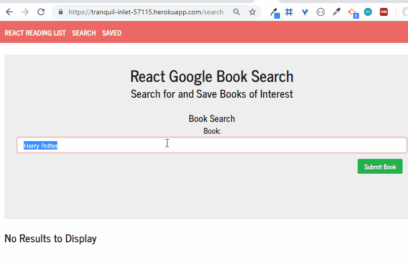
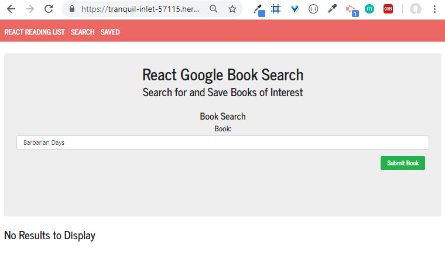
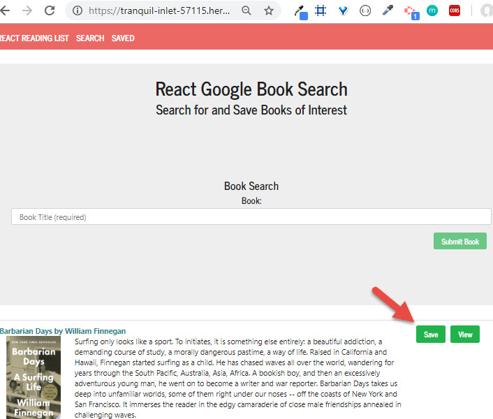
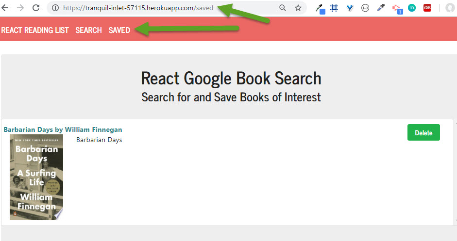
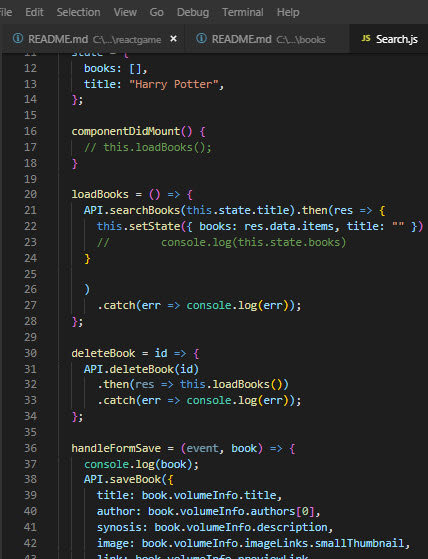

# NYT Google Books Search

### Overview

React-based Google Books Search app. 
Includes: React components 
  - work with helper/util functions, 
  - and utilizes React lifecycle methods to query and display books based on user searches. 
  - Also uses Node, Express and MongoDB so that users can save books to review or purchase later.

* Consists of 2 Pages 

Below are a gif and some images of the app flow: User lands on page > Searches for a book > picks one or more to save :

User can search

And save

And key code snippet

App build to following spec- wireframes:

  * [Search](Search.png) - User can search for books via the Google Books API and render them here. User has the option to "View" a book, bringing them to the book on Google Books, or "Save" a book, saving it to the Mongo database.

  * [Saved](Saved.png) - Renders all books saved to the Mongo database. User has an option to "View" the book, bringing them to the book on Google Books, or "Delete" a book, removing it from the Mongo database.
